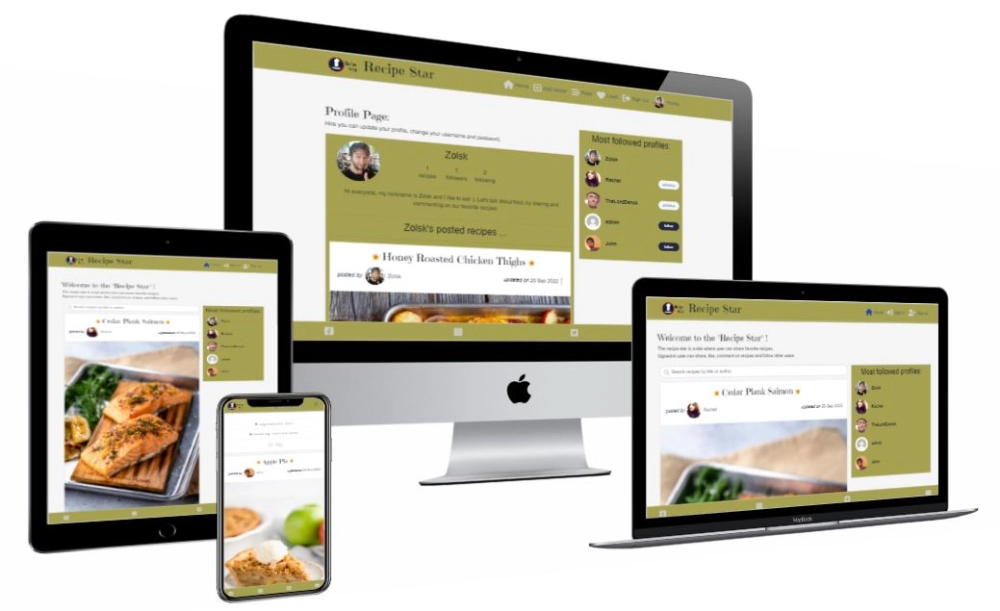

The "Recipe Star" is a social media platform which has been designed for its users to share and comment on their favorite recipes. The application consists of the React app and an API.

*mockup was generated with [techsini.com](https://techsini.com/multi-mockup/index.php)*  
**link to the frontend application ->** ["Recipe Star"](https://recipe-star.herokuapp.com/)  
**link to the backend application ->** ["Recipe Star API"](https://recipe-star-api.herokuapp.com/)  
**link to the backend GitHub repository ->** ["recipe-star-api"](https://github.com/Zolske/recipe-star-api)
***
## Table of Contents
- [Features](#features)
- [Technologies](#technologies) *(languages, frameworks, library's & tools)*
- [Development](#development) *(UX & user stories)*
- [Components](#components)
- [Testing](#testing) *(validator & bugs)*
- Setup and Deployment
- Credits
***
[back to the "Table of Contents"](#table-of-contents)
## Features
- Full featured recipe sharing service
  - user can upload recipes with images and description
  - recipes appear from top to bottom, more are added when user scroll's down
- Social media website
  - user can create account with profile picture and bio
  - user can set a username and password
- when logged in the user can ...
  - Like and comment on recipes
  - create, edit, and delete his comments
  - make new friends and gain followers
  - user can follow and read recipe's of other user
  - can see other posts they have liked
***
[back to the "Table of Contents"](#table-of-contents)
## Technologies
### languages, frameworks, libraries & packages:
|icon|technology|role in the project|
| ---- | ---- | ---- |
||**Html5**|*to give structure to the page and "mark" the content*|
| |**CSS3 & React-Bootstrap**|*to style the content and the page*|
||**JavaScript**|*to implement logic*|
||**React**|*to building user interfaces based on UI components*|
|  |**Python, Django & Django REST**|*for the "backend"*|
||**Git**|*for version control*|
||**GitHub**|*to store the project*|
||**Cloudinary**|*to store images online*|
||**Gunicorn**|*as Python Web Server Gateway Interface*|
||**Heroku**|*to serve the project online*|
||**PostgreSQL**|*as database engine*|
||**Axios**|*is a promise-based HTTP Client for the browser*|
||**JWT**|*are credentials for authentication between client and server*|
### Tools:
|icon|technology|role in the project|
| ---- | ---- | ---- |
| |**VSCode & GitPod**|*IDE to write the code for the project*|
||**Chrome DevTool**|*to debug code and test styles*|
***
[back to the "Table of Contents"](#table-of-contents)
## Development
*Please, click the link below to get to the user experience.*  
**link to user experience ->** [ux documentation](./docs/ux.md)
***
[back to the "Table of Contents"](#table-of-contents)
## Components  
### most used components
| component | purpose | used in |
| --- | --- | --- |
|[PostsPage](./src/pages/posts/PostsPage.js) | contains the (*recipe*) posts | Home, Feed, Liked (*in [App.js](./src/App.js)*)|
|[Post](./src/pages/posts/Post.js)| display a single (*recipe*) post|[PostsPage](./src/pages/posts/PostsPage.js)|
|[Profile](./src/pages/profiles/Profile.js)|display avatar and name of user (*on desktop: a button for following / un-following*) | [PopularProfiles](./src/pages/profiles/PopularProfiles.js)|
|[MoreDropdown](./src/components/MoreDropdown.js)| symbolized by 3 dots, opens a list of other items (*icons*) which can be clicked on (*linked to*)|[Post](./src/pages/posts/Post.js) [ProfilePage](./src/pages/profiles/ProfilePage.js) [Comment](./src/pages/comments/Comment.js)|
|[InfiniteScroll](https://www.npmjs.com/package/react-infinite-scroll-component)|when scrolling down, more content is loaded|[PostPage](./src/pages/posts/Post.js) *loading Comment components*, [PostsPage](./src/pages/posts/PostsPage.js) *loading all, feed or liked Post components*, [ProfilePage](./src/pages/profiles/ProfilePage.js) *loading Post components that belong to the profile*
***
[back to the "Table of Contents"](#table-of-contents)
## Testing
|test|link to test result|result|
| --- | --- | --- |
|Nu Html Checker|[Html result](https://validator.w3.org/nu/?doc=https%3A%2F%2Frecipe-star.herokuapp.com%2F)|Document checking completed. **No errors or warnings** to show.|
|W3C CSS Validator|[CSS result](https://jigsaw.w3.org/css-validator/validator?uri=https%3A%2F%2Frecipe-star.herokuapp.com%2F&profile=css3svg&usermedium=all&warning=1&vextwarning=&lang=en)|Congratulations! **No Error** Found.  |

***
  ## API endpoints

  | Methods                  | PROFILES   _name, content_ | RECIPE   _images, title, category, filter_category, ingredients, instruction_ | COMMENTS   _content_ | LIKES   _id_ | FOLLOWERS   _id_ |
  | ------------------------ | :---------------------------: | :------------------------------------------------------------------------------: | :---------------------: | :-------------: | :-----------------: |
  | **create /  RECIPES** |              no               |                                       yes                                        |           yes           |       yes       |         yes         |
  | **retrieve  GET**     |              yes              |                                       yes                                        |           yes           |       yes       |         yes         |
  | **update  PUT**       |              yes              |                                       yes                                        |           yes           |       no        |         no          |
  | **destroy DELETE**    |              no               |                                       yes                                        |           yes           |       yes       |         yes         |
  | **list GET**          |              yes              |                                       yes                                        |           yes           |       yes       |         yes         |
  | **search GET**        |              no               |                                       yes                                        |           no            |       no        |         no          |

  | Authentication |  registration   **POST**   |      login   **POST**       |       logout   **POST**       |
  | -------------- | :---------------------------: | :----------------------------: | :------------------------------: |
  | endpoint       | "/dj-rest-auth/registration/" |     "/dj-rest-auth/login/"     |     "/dj-rest-auth/logout/"      |
  | expected value | username password1 password2  |       username password        |
  |                |       **user   GET**       |  **refresh token   POST**   |  **change password   POST**   |
  | endpoint       |    "/dj-rest-auth/logout/"    | "/dj-rest-auth/token/refresh/" | "/dj-rest-auth/password/change/" |
  | expected value |                               |         refresh token          |   new_password1 new_password2    |
***