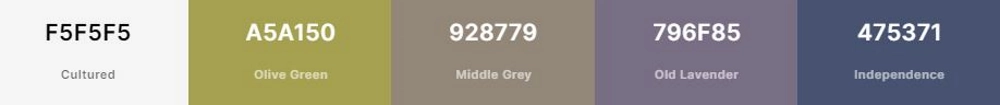

# User Experience (UX)
## Table of Contents
1. [The Strategy](#1-the-strategy)
2. [User Stories](#2-user-stories)
3. [The Scope](#3-the-scope)
4. [The Structure](#4-the-structure)
5. [The Skeleton](#5-the-skeleton)
6. [The Surface](#6-the-surface)
***
[back to the "Table of Contents"](#table-of-contents)
## 1. The Strategy
*Describes the idea of the project, what is its purpose, and who is it for.*
### What is the purpose of the product?
*The purpose of the site is to create a social platform where they can share and comment on each others recipes. The following features are needed to achieve this goal:*
1. the possibility for the user to log-in and out
2. the ability to update the users profile *(name, picture, bio, password)*
3. the capability to upload recipes *(picture, title, ingredients, method)*
4. to interact with other users by writing comments and (un)following there profile
5. the tools to change or delete recipes and comments
### Who is the product for?
*The audience for the website are:*
1. as the **owner**, I want that my site is visited and revisited by as many users as possible
2. as the **user**, I want to have a platform on which I can share easily my recipes and comments
3. as a **visitor**, I want to get an idea what the side is about before signing up
***
[back to the "Table of Contents"](#table-of-contents)
## 2. User Stories
*Please, follow the links to the "Recipe Star" GitHub repository where the user stories have been used to develop the project. The Stories are based on the strategy which defines the purpose and audience of the project. The stories have been prioritized with the "**MoSCoW**" method and have served as the basis to an "agile" development approach.*  
**user story kanban ->** [progress tracker](https://github.com/users/Zolske/projects/5/views/1)  
**user story issues ->** [closed issues](https://github.com/Zolske/recipe-star/issues?q=is%3Aissue+is%3Aclosed)
***
[back to the "Table of Contents"](#table-of-contents)
## 3. The Scope
*Contains the features which are based on the "user stories" that are implemented in this release.*  
### main feature:
#### **1. CRUD functionality:**
- user can **c**reate, **r**ead, **u**pdate and **d**elete recipes and comments
#### **2. authentication:**
- user can create account which gives only him the ability to...  
    - change his personal information (*profile picture, username, bio*)
    - change his recipes and comments  
***
[back to the "Table of Contents"](#table-of-contents)
## 4. The Structure
*Describes the logic and the relational database model.*
### database model:
*Please, double click to enlarge the image.*  

***
[back to the "Table of Contents"](#table-of-contents)
## 5. The Skeleton
### wireframe:
*desktop landing page:*  
  
*mobile landing page:*  

***
[back to the "Table of Contents"](#table-of-contents)
## 6. The Surface
### color scheme:
*color platte:*
  
White has been chosen as the background to symbolize a white table cloth. The other colors are chosen because they complement the background color nicely and give a good contrast.
### typography:
*title font:*  
  
**link to Google Fonts ->** [Emailys Candy](https://fonts.google.com/specimen/Emilys+Candy?query=Neapolitan&preview.text=Emilys%20Candy&preview.text_type=custom)  
The font was designed by Crystal Kluge of Neapolitan. I chose the font because it looks like the kind of writing you would write with icing on a cake. The Site itself is supposed to bring a friendly and light atmosphere across. I believe, the font helps to achieve that.  
### navigation:  
*navigation:*  
   
The navigation is supposed to be easy and intuitive. Icons help the user to navigate intuitively. I also let the navbar stick, so it is always accessible.

***